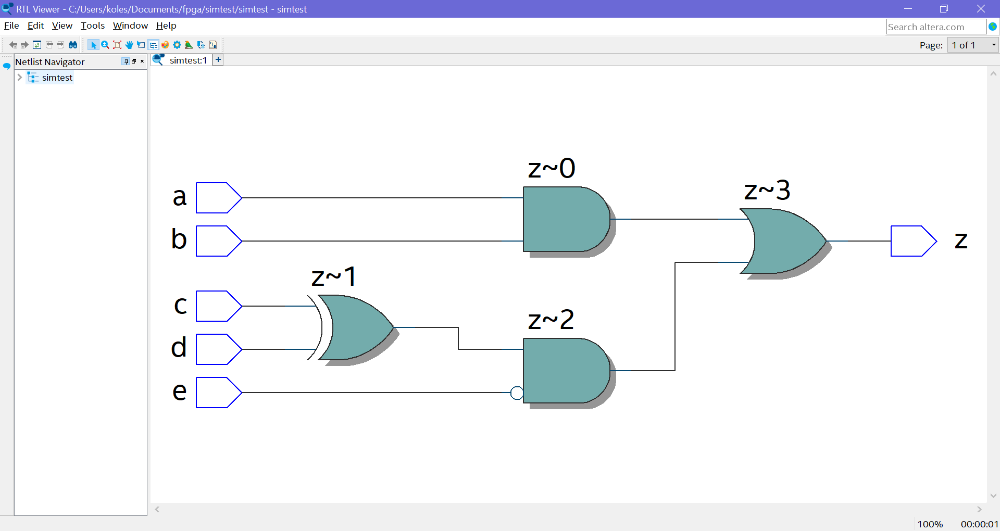
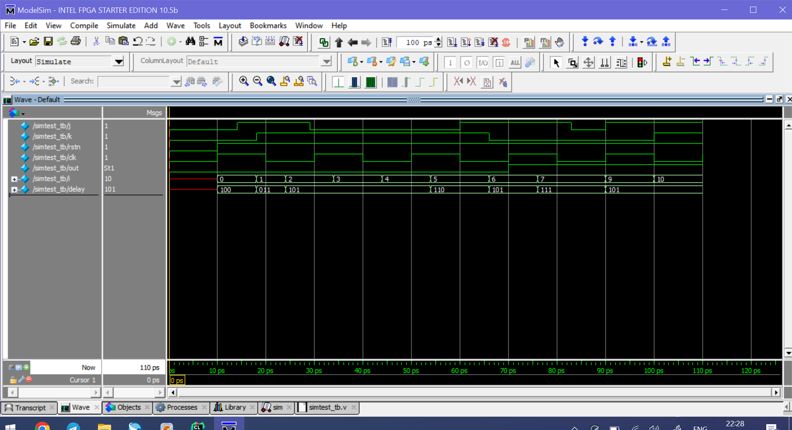

# Пример из Verilog always block

Исследуемый модуль:

```verilog
module simtest (
input a,
input b,
input c,
input d,
output reg o
);

always @ (a or b or c or d) begin
	o<=~((a&b)|(c^d));
end

endmodule
```

Его testbench:

```verilog
module simtest_tb;

reg a,b,c,d;
wire out;

simtest simtest_DUT (a,b,c,d,out);

initial begin

#5
a = 0;
b = 0;
c = 0;
d = 0;
#5
a = 1;
b = 0;
c = 0;
d = 0;
#5
a = 0;
b = 1;
c = 0;
d = 0;
#5
a = 1;
b = 1;
c = 0;
d = 0;
#5
a = 0;
b = 0;
c = 1;
d = 0;
#5
a = 1;
b = 0;
c = 1;
d = 0;
#5
a = 0;
b = 1;
c = 1;
d = 0;
#5
a = 1;
b = 1;
c = 1;
d = 0;
#5
a = 0;
b = 0;
c = 0;
d = 1;

#10
$stop;

end

endmodule
```

Результат симуляции:


RTL схема:


Testbench можно было и умнее написать (как в следующем примере).

# Пример 1 из Combinatorial logic with always

Исследуемый модуль:

```verilog
module simtest (
 input a, b, c, d, e,
output reg z
);

always @ ( a or b or c or d or e) begin
z= ((a&b) | (c^d) &~e);
end

endmodule
```

Его testbench:

```verilog
module simtest_tb;

reg a,b,c,d,e;
wire out;
integer i;

simtest simtest_DUT (a,b,c,d,e,out);

initial begin

a<=0;
b<=0;
c<=0;
d<=0;
e<=0;

for (i = 0; i<32; i = i+1) begin
	{a,b,c,d,e} = i;
	#10;
end

#10
$stop;

end

endmodule
```

Результат симуляции:


RTL схема:


# Пример 2 из Combinatorial logic with always: Half adder

Исследуемый модуль:

```verilog
module simtest (
 input a, b,
output reg sum, cout
);

always @ ( a or b) begin
	{cout, sum} = a+b;
end

endmodule
```

Его testbench:

```verilog
module simtest_tb;

reg a,b;
wire sum, cout;
integer i;

simtest simtest_DUT (a,b,sum,cout);

initial begin

a<=0;
b<=0;

for (i = 0; i<4; i = i+1) begin
	{a,b} = i;
	#10;
end

#10
$stop;

end

endmodule
```

Результат симуляции:


RTL схема:


# Пример 3 из Combinatorial logic with always: Full adder

Исследуемый модуль:

```verilog
module simtest (
 input a, b, cin,
output reg sum, cout
);

always @ ( a or b) begin
	{cout, sum} = a+b+cin;
end

endmodule
```

Его testbench:

```verilog
module simtest_tb;

reg a, b, cin;
wire sum, cout;
integer i;

simtest simtest_DUT (a,b,cin,sum,cout);

initial begin

a<=0;
b<=0;
cin<=0;

for (i = 0; i<8; i = i+1) begin
	{a,b,cin} = i;
	#10;
end

#10
$stop;

end

endmodule
```

Результат симуляции:


RTL схема:


# Пример 4 из Combinatorial logic with always: Mux 2x1

Исследуемый модуль:

```verilog
module simtest (
 input a, b,sel,
output reg c
);

always @ ( a or b or sel) begin
	c=sel?a:b;
end

endmodule
```

Его testbench:

```verilog
module simtest_tb;

reg a, b, sel;
wire c;
integer i;

simtest simtest_DUT (a,b,sel,c);

initial begin

a<=0;
b<=0;
sel<=0;

for (i = 0; i<8; i = i+1) begin
	{a,b,sel} = i;
	#10;
end

#10
$stop;

end

endmodule
```

Результат симуляции:


RTL схема:


# Пример 5 из Combinatorial logic with always: Demux 1x4

Исследуемый модуль:

```verilog
module simtest (
 input f,
 input [1:0] sel,
output reg a,b,c,d
);

always @ ( f or sel ) begin
	a =f &~sel[1] & ~sel[0];
	b =f & sel[1] & ~sel[0];
	c =f & ~sel[1] & sel[0];
	d =f & sel[1] & sel[0];
end

endmodule
```

Его testbench:

```verilog
module simtest_tb;

reg f;
reg [1:0] sel;
wire a,b,c,d;
integer i;

simtest simtest_DUT (f,sel,a,b,c,d);

initial begin

f<=0;
sel<=0;

for (i = 0; i<8; i = i+1) begin
	{f,sel} = i;
	#10;
end

#10
$stop;

end

endmodule
```

Результат симуляции:


RTL схема:


# Пример 6 из Combinatorial logic with always: Decoder 4x16

Исследуемый модуль:

```verilog
module simtest (
 input en,
 input [3:0] in,
output reg [15:0] out
);

always @ ( en or in ) begin
	out = en? 1 << in:0;
end

endmodule
```

Его testbench:

```verilog
module simtest_tb;

reg en;
reg [3:0] in;
wire [15:0] out;
integer i;

simtest simtest_DUT (en,in,out);

initial begin

en<=0;
in<=0;

for (i = 0; i<32; i = i+1) begin
	{en,in} = i;
	#10;
end

#10
$stop;

end

endmodule
```

Результат симуляции:


RTL схема:


# Пример 1 из Sequential logic with always: JK Flip Flop

Исследуемый модуль:

```verilog
module simtest (
 input j,k,rstn,clk,
output reg out
);

always @ ( posedge clk or negedge rstn ) begin
	if (!rstn) begin
		out<=0;
	end else begin
	out<=(j&~out) | (!k&out);
	end
end

endmodule
```

Его testbench:

```verilog
	module simtest_tb;

	reg j,k,rstn,clk;
	wire  out;
	integer i;
	reg [2:0] delay;
	
	always #10 clk=~clk;

	simtest simtest_DUT (j,k,rstn,clk,out);

	initial begin

	{j,k,	rstn,clk}<=0;
	#10 rstn <=1;	

	for (i = 0; i<10; i = i+1) begin
		delay = $random;
		#(delay) j = $random;
		#(delay) k = $random;
	end

	#10
	$stop;

	end

	endmodule
```

Результат симуляции:



RTL схема:


# Пример 2 из Sequential logic with always: Mod 10 counter

Исследуемый модуль:

```verilog
module simtest (
 input clk,rstn,
output reg [3:0] out
);

always @ ( posedge clk or negedge rstn ) begin
	if (!rstn) begin
		out<=0;
	end else begin
	if (out ==10)
		out <=0;
	else
		out <= out + 1;
	end
end

endmodule
```

Его testbench:

```verilog
	module simtest_tb;

	reg rstn,clk;
	wire [3:0] out;
	integer i;
	
	always #10 clk=~clk;

	simtest simtest_DUT (clk,rstn,out);

	initial begin

	{rstn,clk}<=0;
	#10 rstn <=1;	

	#450
	$stop;

	end

	endmodule
```

Результат симуляции:


RTL схема:


# Пример 3 из Sequential logic with always: 4 bit left shift register

Исследуемый модуль:

```verilog
module simtest (
 input d, clk,rstn,
output reg [3:0] out
);

always @ ( posedge clk or negedge rstn ) begin
	if (!rstn) begin
		out<=0;
	end else begin
		out <= {out[2:0],d};
	end
end

endmodule
```

Его testbench:

```verilog
	module simtest_tb;

	reg rstn,clk,d;
	wire [3:0] out;
	integer i;
	
	always #10 clk=~clk;

	simtest simtest_DUT (d,clk,rstn,out);

	initial begin

	{rstn,clk,d}<=0;
	#10 rstn <=1;	

    for (i=0; i<20; i = i + 1) begin
    @(posedge clk) d<=$random;
    end


	#10
	$stop;

	end

	endmodule
```

Результат симуляции:


RTL схема:
